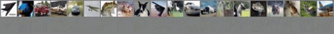

## Neural Discrete Representation Learning, VQ-VAE
Pytorch implementation of [Neural Discrete Representation Learning](https://arxiv.org/abs/1711.00937)
<br><br>
## Requirements
* python 3.6
* pytorch 0.2.0_4
* visdom
<br><br>
## RESULT : MNIST

<br>
## RESULT : CIFAR10
reconstruction of randomly selected, fixed images
<br>

<br>
reconstruction of random samples
<br>

<br>
you can reproduce similar results by :
```javascript
python main.py --dataset CIFAR10 --batch_size 100 --k_dim 256 --z_dim 256
```

## To do:
- [x] model save/load
- [x] parameter initializaiton
- [x] image save
- [ ] visdom -> tensorboardX
- [ ] learning prior p(z) using PixelCNN
- [ ] image sampling( dummy input => (PixelCNN) => Z_dec => (Decoder) => image )
- [ ] refactoring
- [ ] add references and acknowledgements
